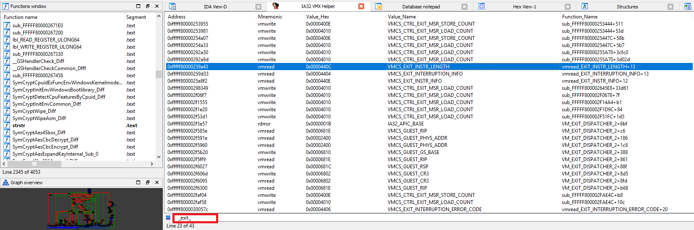

# Re-Scripts
 
[IA32-VMX-Helper](#IA32-VMX-Helper) (IDA-Script)

[IA32-MSR-Decoder](#IA32-MSR-Decoder) (IDA-Script)

---

# IA32 VMX Helper
It's an IDA script (Updated IA32 MSR Decoder) which helps you to find and decode all MSR/VMCS codes inside binary files, for using it just open the script in IDA (`Alt + F7`)

### Features
- Add lots off MSR/VMCS Symbolic constant to IDA
- Find and Decode IA32 MSR/VMCS values
- Highlighting MSR/VMCS values and related instructions, such as `rdmsr` or `vmread` by propper comment and Symbolic constants
- Just search and explore all founded values

# IA32 MSR Decoder

It's an IDA script which helps you to find and decode all MSR codes inside binary files, for using it just open the script in IDA (`Alt + F7`)

